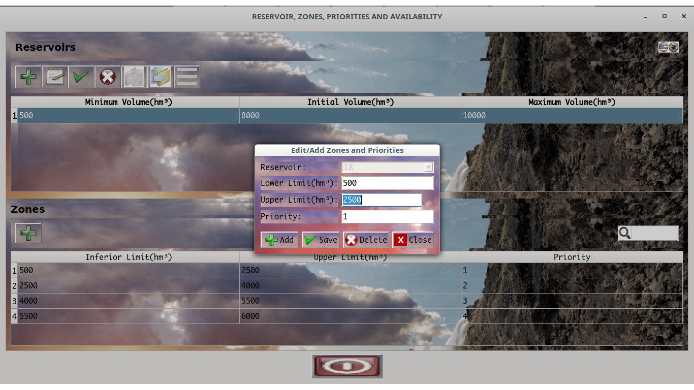
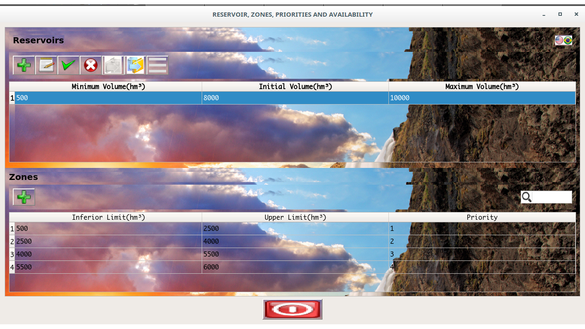
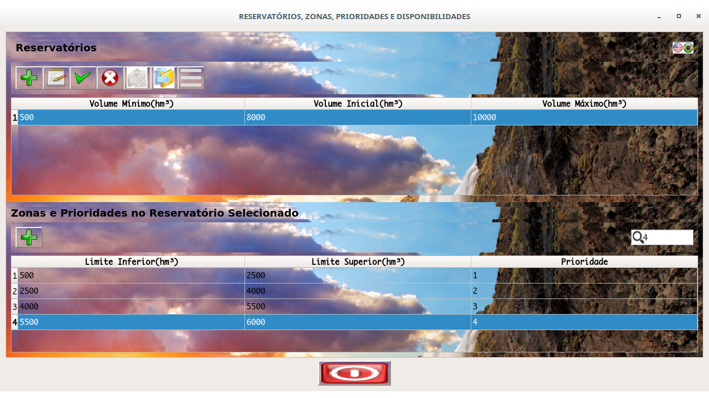

# QT5 Complete Sample Project for Reservoirs, Zones and Priorities

QT is one awesome  framework and platform for more  and more awesome projects facilitating each better productivity and usability of hundreds os types of industries applications and open-source projects.
The idea of that simple project is based in some rules presented on (1) and (2) tasks:

*[SergioVieira GitHub](https://github.com/sergiosvieira/funceme-selecao-siga/blob/master/tasks.md)

 It's showing the big power of uses with C/C++ languages and that languages modernizing and facilitating much of tedious  configurations needed in that types of projects.

The focus here is not implement the more advanced interface of the universe and the more complete project possible but show more and more resources possible in one unique project as base for other implementations or ideas. Any person can use and studied each idea or advance that idea as to desire.

For that moment the GUI is in Portuguese(pt_BR) and English(en_US) only, but, on available time I will be localize for more languages.

Things that you'll can view here is:

* Lambdas applied in connect SIGNALS and SLOTS.

* QTableView  of use with various types of advanced resources.

* SQLite3 use with merge between inline SQL and Model/View  commit approach. The drivers available are compiled for linux and windows and you can use the same drivers in linux or windows without need recompile the drivers. DBSchema as resource.

* Project customized with process for send all needed resources for running folder for executing on any relative path.(In that moment for Windows and Linux/Unix).

* Components customization with new resources(Icon on QLineText search field).

* QDataWidgetMapper advanced uses.

* Search filters for model used in QTableView and QDataWidgetMapper.

* Customized models for export and import data for QTableView and QDataWidgetMapper.

* Export and import informations for database via simple text files directly from QTableView.

* Various types of validators based on QValidator or not.

* All types of SIGNALS between mouse and keyboard keys actions in various components.

* Translations for English and Portuguese.

* Not have 1000 lines of code and have one bit part of one catalog for Reservoir operation and some features for zones and priorities.

* [The backgroung is one image for one local that I like much: Iceland.](https://vividscreen.info/pic/iceland/20249/for-widescreen-desktop-pc-1920x1080-full-hd)

## How to use...

> The image below  show the main interface with tooltips in each component with 2 seconds showing the functions in each component  with mouseover.
All operations can be executed about explain the tootips.

The first step is register one reservoir using the QTableView "Reservoir" clicking on plus signal button on as in image below:

Click after in Save button:

The next step is include zones and priorities for zones. Said that with one "Reservoir" selected on your own QTableView you need click on plus signal button on QTableView "Zones and Priorities on Selected Reservoir":

In that step show one form with fields with rules for values  as that:

* Lower Limit(hm³) < Upper Limit(hm³) <=  Maximum Volume(hm³)

Other rule is:

* Priotity is always growing starting from 1(one) and not repeated and the fields on QTableView for zones is ordered for Priority.

On the same form you  found Save button and after click on it the data is saved in database newly.

If you desire you can add various zones sequentially clicking on plus signal button on form.

Other rule on same form is that you can delete only the last zone with the major priority on that same form you can click on  button with "X" as below image:

After catalog "Reservoir" and "Zones and Priorities" you get the image below:

If the list of zones is more extent you can search one zone with search box at right on QTableView. Only digit the priority and execute return key after that the line is showed and selected.

 

In sequence each of the buttons below execute these tasks described on information for you. Observe the last image showing the last task after the images for buttons:

* Export button 

* Import button 

* Availability button 

The availability water volume for reservoir is showed below:

This work is executed for all interested on technologies that facilitate your days and use the better you know on advance your business.

Thank you!

